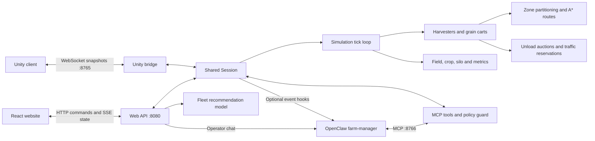

# John Deere Multi-Agent Harvest Simulation

A Python simulation of a harvesting campaign. Harvesters cover assigned field zones,
request unloading, and transfer grain to mobile carts. Carts collect the grain and
return it to a silo. The system records harvest progress, machine utilization, fuel
consumption, and estimated emissions.

This repository contains the simulation engine, the Unity/Web API server, a fleet
recommendation module, and an optional OpenClaw supervisor. It can run independently
in a terminal or supply a shared campaign to the Unity and React clients.

## Architecture



The Python engine owns the simulation state. Unity renders snapshots; React sends
configuration and playback commands and displays metrics. Enabling `--web-port` or
`--with-mcp` makes all connected clients observe the same campaign. The standalone
console and Matplotlib views run their own simulation without the server.

| Location | Responsibility |
| --- | --- |
| `main.py` | Console and Matplotlib entry point |
| `johndeere/world/` | Grid generation, obstacles, crop and field queries |
| `johndeere/planning/` | Pathfinding, connected work zones and coverage routes |
| `johndeere/agents/` | Harvester and grain-cart state machines |
| `johndeere/coordination/` | Unloading assignments and movement reservations |
| `johndeere/simulation.py` | Tick loop, snapshots and simulation commands |
| `johndeere/metrics.py` | Fleet metrics |
| `johndeere/fleet_advisor.py` | Budget-constrained fleet estimates |
| `Servidor/server.py` | Shared session and Unity WebSocket bridge |
| `Servidor/web.py` | HTTP API, SSE stream, chat and recommendations |
| `Servidor/agent/` | MCP tools, command policy and event watcher |
| `agent/` | OpenClaw configuration example, skill and launch scripts |
| `tests/` | Focused regression tests |

## Installation

Use Python 3.12. The engine and console frontend use the standard library; the
requirements file adds the visualization and server dependencies.

```bash
git clone --branch DemoScript https://github.com/Fernando94654/John-Deere-Multi-Agent-System.git
cd John-Deere-Multi-Agent-System
python3 -m venv .venv
source .venv/bin/activate
pip install -r requirements.txt
```

OpenClaw is optional. Its demo launcher also requires Bash and Linux utilities such
as `ss` and `setsid`. Unity and the React website are separate repositories.

## Run the simulation

### Console or 2D visualization

```bash
# Reproducible console run; print the result without replaying every frame.
python main.py --harvesters 3 --carts 2 --seed 42 --no-animation

# Animated 2D view.
python main.py --frontend visual --harvesters 3 --carts 2 --seed 42

# Export an animation.
python main.py --frontend visual --seed 42 --save run.gif
```

### Server for Unity and React

```bash
python Servidor/server.py --host 127.0.0.1 --web-port 8080 \
  --rows 16 --cols 22 --harvesters 3 --carts 2 --seed 42
```

The server waits for a client to start a campaign. Add `--autostart` to start on
launch. Stop it with Ctrl-C.

| Endpoint | Consumer |
| --- | --- |
| `ws://127.0.0.1:8765` | Unity |
| `http://127.0.0.1:8080/api/...` | React or another HTTP client |
| `http://127.0.0.1:8766/mcp` | OpenClaw, when `--with-mcp` is enabled |

Configure the website's `VITE_API_URL` as `http://localhost:8080` and Unity's
`WebSocketManager.serverUrl` as `ws://localhost:8765`. The React site and compiled
Unity player must be served separately. The API root is not the React application;
its optional built-in dashboard file is not included in this branch.

For the three-repository setup, Unity build instructions, and Docker launcher, use
[John-Deere-Multi-Agent-System-Integration](https://github.com/Fernando94654/John-Deere-Multi-Agent-System-Integration).
Its submodule pins determine which server revision Docker builds; editing this
standalone checkout does not update those pins automatically.

### Demo with OpenClaw

Start with [`agent/openclaw.example.json5`](agent/openclaw.example.json5). Configure
OpenClaw with the `farm-manager` agent, a working model provider, and:

- `gateway.mode: "local"` and the gateway port, normally `18789`.
- MCP server `johndeere` at `http://127.0.0.1:8766/mcp`, using `streamable-http`.
- An absolute `skills.load.extraDirs` path to this repository's `agent/skills`.
- A nonempty `hooks.token` and the hook settings from the example.

The launcher reads `~/.openclaw/openclaw.json` with Python's JSON parser: save it as
strict JSON, without the comments in the example. `OPENCLAW_CONFIG_PATH` can select
another file. Keep credentials in local configuration, outside the repository.

```bash
openclaw config validate
./agent/run-demo.sh                 # Foreground; Ctrl-C stops both processes
./agent/run-demo.sh daemon          # Background mode
./agent/run-demo.sh status          # Inspect background processes and log paths
./agent/run-demo.sh stop            # Stop the background demo
```

Choose either foreground or background mode. The launcher starts the gateway and
server, enables MCP and the web API, and waits for an operator to start a campaign.
Its defaults are a 16 × 22 field, four harvesters, two carts, and one second per tick.
It attempts to release occupied demo ports before launching; stop other services
using those ports before the presentation.

| Setting | Effect |
| --- | --- |
| `AUTOSTART=1` | Start a campaign immediately |
| `WEB_PORT=8081` | Change the web API port; `0` disables it |
| `WEB_TOKEN=...` | Require a bearer token for web write requests |
| `JD_RUNDIR=/path` | Override PID/log directory; default `/tmp/jd-demo` |
| Extra server arguments | Override field, fleet, seed or timing parameters |

```bash
AUTOSTART=1 ./agent/run-demo.sh --harvesters 3 --carts 2 --seed 42
openclaw mcp probe johndeere
openclaw agent --agent farm-manager --session-key harvest -m "How is the harvest going?"
```

The gateway log is `/tmp/openclaw-gateway-demo.log`; detached simulation output is
`$JD_RUNDIR/sim.log`. **This branch's demo enables event-triggered supervisor turns**
through `--wake-url`. To use MCP only on operator request, launch the server manually
with `--with-mcp` and omit `--wake-url`, then start `openclaw gateway` separately.

## Intelligent coordination and AI scope

The system has three distinct decision mechanisms:

| Mechanism | Implementation | Scope |
| --- | --- | --- |
| Autonomous simulation agents | State machines, A*, zone coverage, unloading auctions and traffic reservations | Decide movement, harvesting and grain transport on every tick; no LLM required |
| Fleet recommendations | Deterministic analytical estimates constrained by terrain and budget | Compare fleet options before starting a run; do not modify the live campaign |
| OpenClaw supervisor | Language model using MCP tools | Inspect conditions, interpret operator requests and make permitted operational changes |

### Simulation agents

The field uses `-1` for obstacles, `0` for bare ground, and `1` for standing crop.
A bare headland surrounds it, and the silo is at `(0, 0)`. Harvesters can cross crop;
carts can only travel over cleared ground. Zero-obstacle fields are supported.

Harvesters receive connected work zones and follow serpentine coverage routes,
using A* to connect targets around obstacles. Available carts bid for unloading
requests based on route cost, available capacity and waiting time. Grain transfer
requires the cart to dock on the harvester's left side. Movement reservations and
rerouting resolve traffic conflicts; the silo acts as a shared depot.

### Supervisor

The MCP interface exposes 14 tools, grouped by purpose:

- Observation: `get_fleet_state`, `get_field_map`, `list_recent_events`,
  `explain_last_decision`.
- Coordination: `rebalance_zones`, `prioritize_region`, `set_policy`, `add_cart`.
- Incidents and reporting: `disable_machine`, `repair_machine`, `announce`.
- Playback: `pause_run`, `resume_run`, `restart_run`.

The supervisor requests operational changes; routes and cell movements remain in the
engine. A policy guard validates MCP operations, limits changes, and records allowed
and refused decisions. The watcher detects waiting harvesters, uneven workloads,
fleet idleness and machine breakdowns. With a wake URL configured, these events can
request a model turn.

[`agent/skills/farm-manager/SKILL.md`](agent/skills/farm-manager/SKILL.md) defines the
supervisor's operating instructions. The model is not required for normal harvesting.
The optional [`agent/orin-model.sh`](agent/orin-model.sh) manages an Ollama container
and SSH tunnel on a Jetson Orin; it requires separate host and provider configuration.
It is not part of the default demo startup.

### Fleet recommendations

`POST /api/fleet-recommendations` returns four profiles: `minimum_duration`,
`minimum_machinery`, `lower_consumption`, and `balanced`. They contain estimated
cost and operating metrics, not the result of executing the requested campaign.
Selecting a recommendation does not apply it; the website submits the chosen fleet
through `/api/config` when the operator starts the simulation.

The standalone API disables recommendations unless `FLEET_RECOMMENDATIONS_ENABLED`
is enabled and the cost settings are supplied. The demo launcher enables them with
these **placeholder costs**, which are not equipment quotations:

| Variable | Demo default |
| --- | --- |
| `FLEET_RECOMMENDATIONS_ENABLED` | `1` |
| `FLEET_COST_CURRENCY` | `MXN` |
| `FLEET_COST_VERSION` | `demo-2026-09` |
| `FLEET_HARVESTER_COST` | `100` |
| `FLEET_CART_COST` | `40` |

Export different values before launching to use another cost scenario.

## HTTP and Unity interfaces

| Method | Route | Purpose |
| --- | --- | --- |
| GET | `/api/config`, `/api/state`, `/api/field` | Configuration, current metrics and field data |
| GET | `/api/state/stream` | Per-tick updates through Server-Sent Events |
| GET | `/api/history`, `/api/runs` | Tick history and run summaries |
| GET | `/api/events`, `/api/decisions` | Watcher events and audit records |
| POST | `/api/config` | Apply field/fleet parameters and queue a new campaign |
| POST | `/api/commands/{action}` | `start`, `pause`, `continue`, `reset`, `restart` |
| POST | `/api/policy`, `/api/rebalance`, `/api/prioritize`, `/api/carts` | Operational changes |
| POST | `/api/machines/{id}/{disable,repair}` | Harvester incident controls |
| POST | `/api/announce` | Set the displayed narration |
| POST | `/api/chat` | Relay an operator message to OpenClaw |
| POST | `/api/fleet-recommendations` | Compare affordable fleet options |

Example: configure three harvesters on a field without obstacles, then reset it.

```bash
curl -X POST http://localhost:8080/api/config \
  -H 'Content-Type: application/json' \
  -d '{"rows":16,"cols":22,"harvesters":3,"carts":2,"minObstacles":0,"maxObstacles":0}'

curl -X POST http://localhost:8080/api/commands/reset
curl -X POST http://localhost:8080/api/commands/continue
```

`reset` rebuilds the current configuration with the same seed and leaves it paused.
`continue` resumes that campaign. `restart` rebuilds and runs it; `newSeed: true`
requests a new field. To change the fleet, submit `/api/config`. Rebuilds are queued;
clients should wait for a new `runId` in the state stream before treating them as applied.
When `--web-token` is set, add `Authorization: Bearer <token>` to write requests.

Unity sends JSON commands such as `{"command":"pause"}` or
`{"command":"restart","newSeed":true}`. Snapshots include the tick, tick interval,
grid dimensions, flattened crop cells, obstacles, silo, vehicles, headings, loads and
metrics. Flat cell index `row * columns + column` is used for Unity's JSON parser.

## Metrics and limitations

The engine records distance, idle ticks, fuel, harvested grain, delivered grain,
grain in transit and estimated CO₂. Fuel and emissions use fixed coefficients in
`johndeere/config.py`; these are simulation assumptions, not measurements of actual
John Deere machinery.

The model uses one silo, a discrete grid and fixed machine specifications. It does
not model soil conditions, real vehicle dynamics or continuous geography. Fleet
recommendations are estimates; LLM supervision is an optional decision layer, not
a guarantee of improved performance. Runtime state and history are held in memory
and are lost when the server stops. Fields must have enough reachable crop for the
requested fleet; rejected rebuilds leave the previous campaign in place.

## Verification

Run the focused test suite from the repository root:

```bash
python -m unittest discover -s tests
```

Tests cover fleet recommendation behavior and the web configuration/reset regression.
For command-line options, use `python main.py --help` and
`python Servidor/server.py --help`. Frontend rendering and model-provider connectivity
should be checked in their respective environments before presenting the integrated demo.
